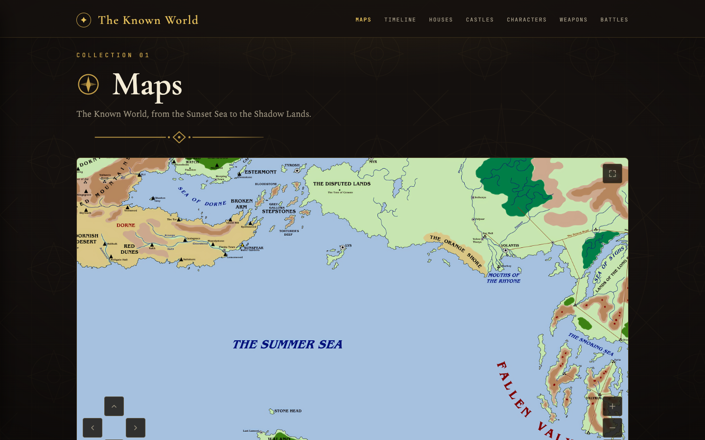
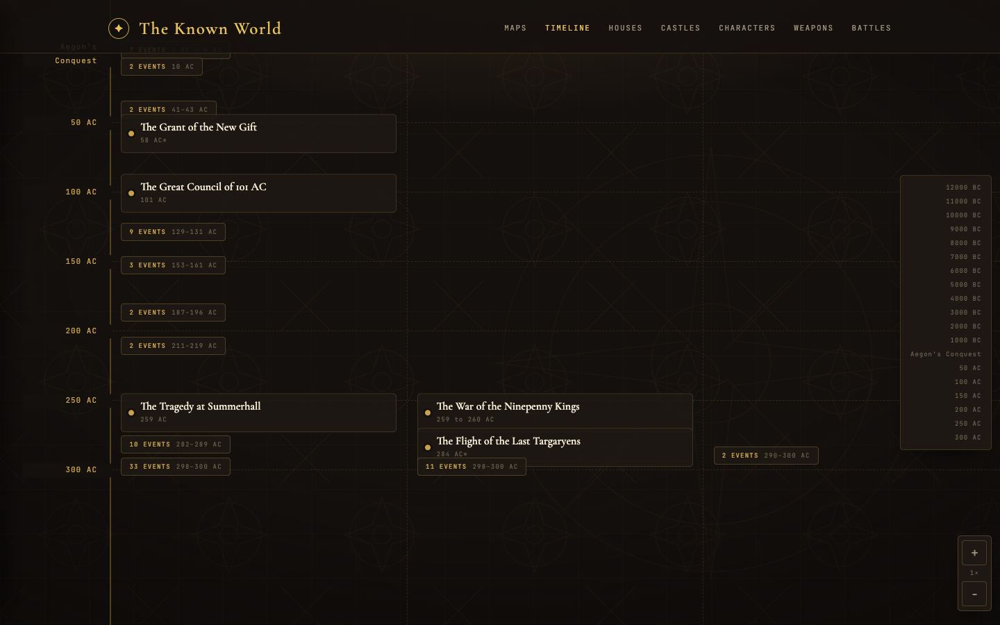
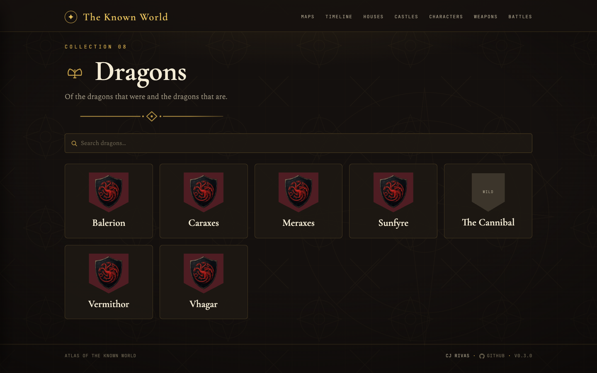

# Atlas of the Known World

An interactive, static atlas and encyclopedia for the world of _A Song of Ice
and Fire_. It combines maps, a historical timeline, house and character
genealogies, and reference pages for battles, dragons, and weapons.

## Screenshots

|                                                                                             |                                                                                      |
| ------------------------------------------------------------------------------------------- | ------------------------------------------------------------------------------------ |
| **Main atlas menu**<br>                        | **Interactive world map**<br>     |
| **Timeline**<br>            | **House index**<br>      |
| **House Stark**<br>                    | **House Targaryen**<br> |
| **Character index**<br> | **Jon Snow**<br>  |
| **Dragons**<br>                          | **Winterfell**<br>  |

## Stack

- Next.js App Router with static export
- React and TypeScript
- SCSS modules
- Markdown content with YAML frontmatter, validated by Zod
- Vitest and Testing Library
- Bun for dependency management and scripts
- Netlify for deployment and image transformation

## Requirements

- Node.js 24.16 or newer
- Bun 1.3.14 or newer

## Getting started

Install dependencies and start the development server:

```sh
bun install
bun dev
```

The site is available at <http://localhost:46642>.

## Commands

```sh
bun run dev             # start the development server
bun run test            # run the test suite once
bun run test:watch      # run tests in watch mode
bun run coverage        # generate test coverage
bun run typecheck       # check TypeScript
bun run lint            # run Oxlint (type-aware)
bun run lint:styles     # run Gale on SCSS
bun run format:check    # check formatting with Oxfmt
bun run build           # create the static export in out/
bun run system-check    # run every repository quality gate
```

Repository scripts must be run through Bun. Dependencies are pinned to exact
versions in `package.json`.

## Routes

| Route                 | Description                         |
| --------------------- | ----------------------------------- |
| `/`                   | Main atlas menu                     |
| `/maps/`              | Interactive world map               |
| `/timeline/`          | Chronological battles and events    |
| `/houses/`            | Searchable and grouped house index  |
| `/houses/[slug]/`     | House details and family tree       |
| `/characters/`        | Searchable character index          |
| `/characters/[slug]/` | Character details and relationships |
| `/battles/`           | Battle index                        |
| `/battles/[slug]/`    | Battle details                      |
| `/weapons/`           | Weapon index                        |
| `/weapons/[slug]/`    | Weapon details                      |
| `/dragons/`           | Dragon index                        |
| `/dragons/[slug]/`    | Dragon details                      |
| `/castles/[slug]/`    | Castle details                      |
| `/events/[slug]/`     | Timeline event details              |

## Repository layout

```text
app/         Next.js routes and route-level styles
components/  Reusable UI components and co-located tests
content/     Markdown collections for atlas entities
docs/        Feature specifications, plans, and screenshots
lib/         Content loading, validation, relationships, and utilities
netlify/     Local Netlify build plugins
public/      Images, sigils, maps, and other static assets
styles/      Global design tokens and typographic primitives
```

## Content model

Each entity is stored as `content/<collection>/<slug>.md`. Its filename must
match the `slug` in its YAML frontmatter. Frontmatter is parsed and validated
against the corresponding schema in `lib/schemas.ts`.

Cross-references use slugs. The content-integrity test validates unique slugs,
filename/frontmatter agreement, and references between modeled entities. Run it
directly with:

```sh
bun run test lib/content-integrity.test.ts
```

Named people that are needed for a relationship but do not yet have a complete
article can use the character schema's `placeholder` fields. Draft entries are
excluded from generated route parameters.

## Development workflow

Read `CLAUDE.md` for repository conventions before making changes. In
particular:

1. Create a branch for each feature or bug fix.
2. Keep tests co-located with their implementation.
3. Run `bun run system-check` before handing off a change.
4. Prefix commit subjects with `TKW:`.

The pre-commit hook runs formatting, type checking, linting, and tests. The
pre-push hook runs the production build.

## Deployment

`next.config.ts` configures `output: "export"`, so `bun run build` writes the
deployable site to `out/`. Netlify runs the same build, publishes `out/`, and
uses the custom image loader in `lib/netlify-image-loader.ts` for production
image transformations.

Content source attribution is rendered from each entry's `sources` frontmatter.
