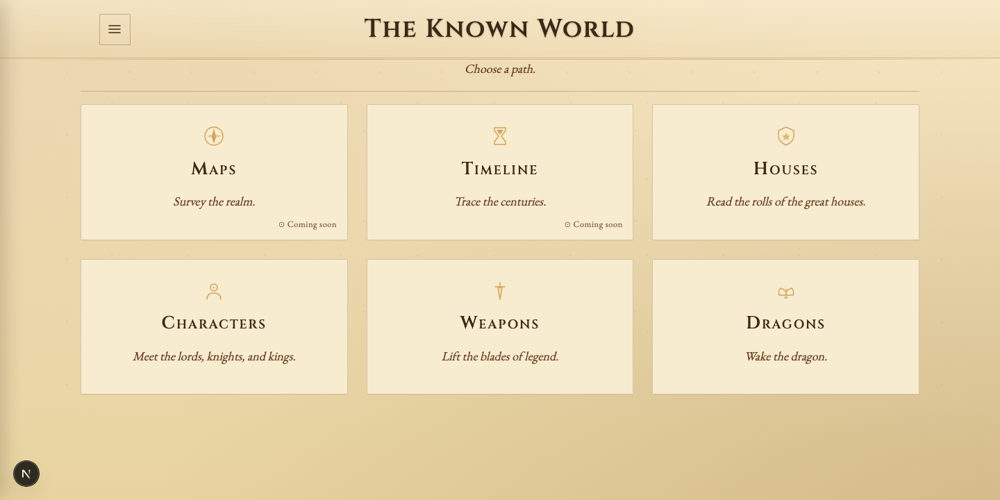
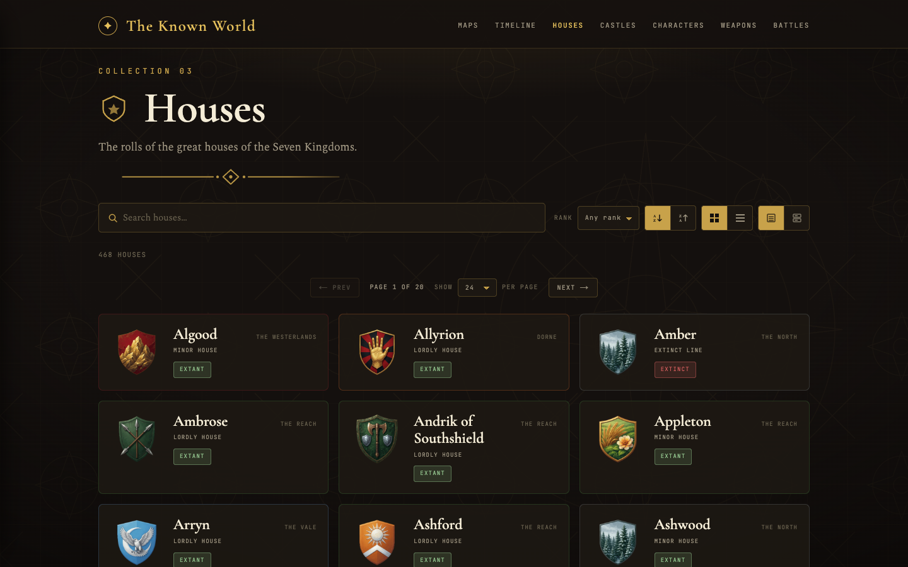
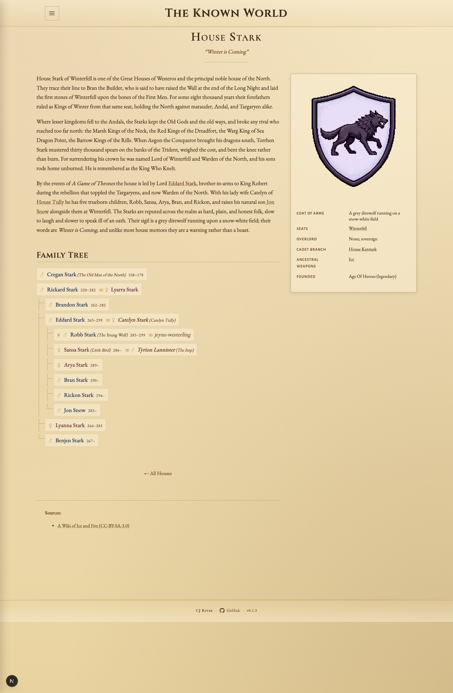
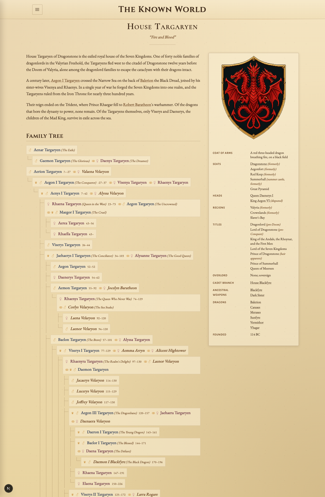
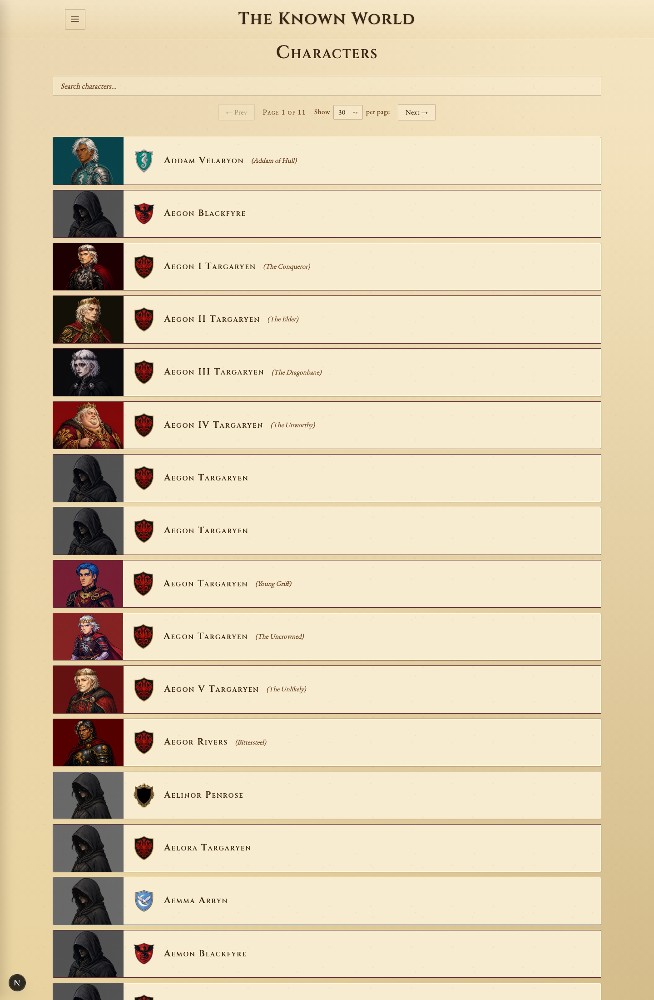
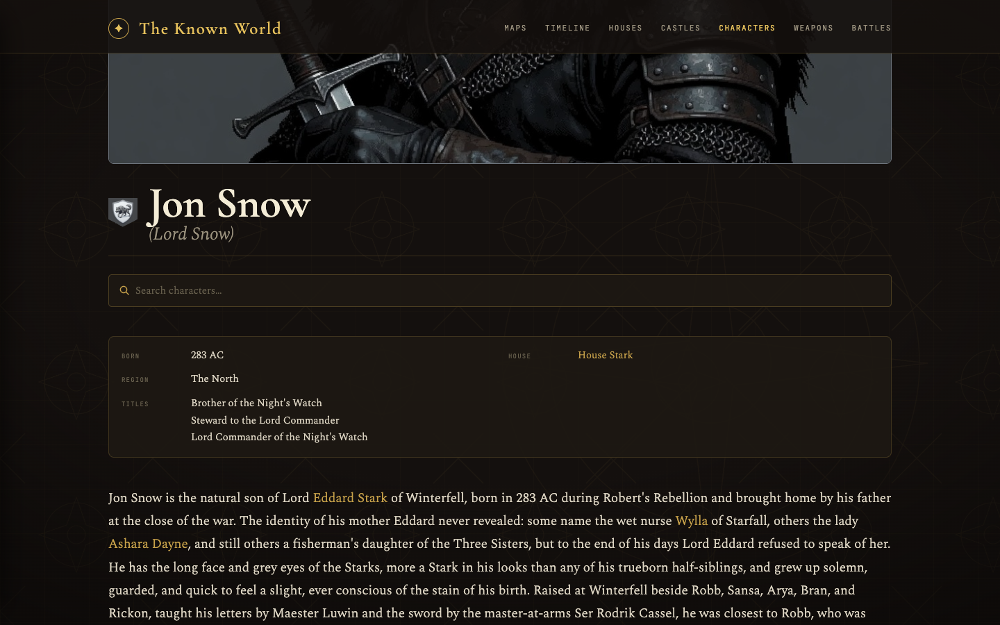
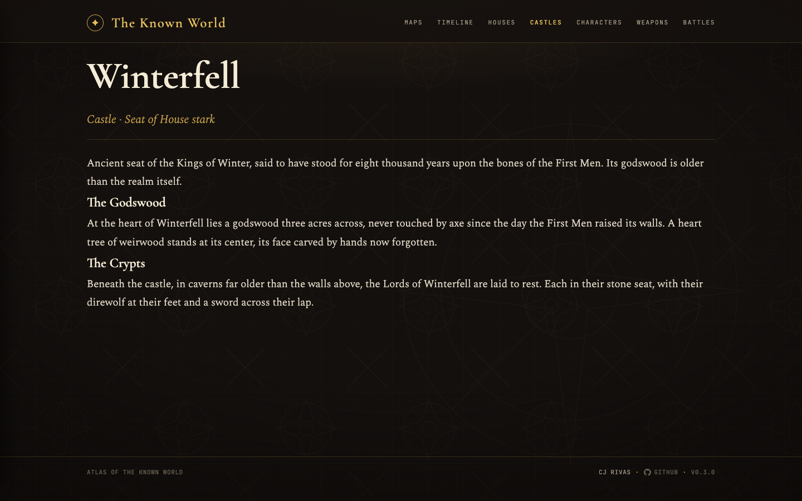

# Atlas of the Known World

An interactive atlas of George R. R. Martin's world of Ice and Fire, covering the maps, timeline, and the rolls of the great houses. Statically generated from a corpus of markdown files with Zod-validated frontmatter, rendered through a parchment-styled UI.



## Stack

- **Next.js 16** (App Router) with `output: 'export'`, so every route is pre-rendered to static HTML.
- **React 19**.
- **TypeScript 5**.
- **Bun** for install, scripts, and the Netlify build.
- **Zod 4** for content schemas.
- **gray-matter** + **remark** / **remark-html** for markdown.
- **react-svg-pan-zoom** for the regional map view.
- **Vitest 4** + **jsdom** + **@testing-library/react** for unit and component tests.
- **Netlify** for hosting (build = `bun run build`, publish = `out/`).

## Getting started

```bash
bun install
bun dev                  # http://localhost:3000
bun test                 # vitest run
bun test:watch
bun run build            # static export → out/
bun run lint
bun run typecheck        # tsc --noEmit
bun run system-check     # lint + typecheck + test, in sequence
bun run prettier         # format every file
bun run prettier:check   # fail if any file is unformatted
bun run prettier:quick   # format only staged files
```

### Git hooks

Husky installs hooks on `bun install` (via the `prepare` script):

- **`pre-commit`** runs `bun system-check` (lint + typecheck + test).
- **`pre-push`** runs `bun run build` to confirm the static export still succeeds.

## Project layout

```
app/                Next.js App Router routes
  page.tsx          Home, main menu of atlas sections
  maps/             Coming-soon stub
  timeline/         Coming-soon stub
  houses/           Index + per-house pages
    [slug]/         Per-house page with family tree
  characters/       Index + per-character pages
    [slug]/         Per-character page (stub)
  castles/[slug]/   Per-castle page
  layout.tsx        Root layout (Cinzel / EB Garamond / Inter fonts)
  not-found.tsx

components/         React components, each paired with a co-located CSS module
  ParchmentLayout, MainMenu, MainMenuTile, ComingSoonPage,
  MapStage, MapMarker, MapLayerToggle,
  FamilyTree, DropCap, Sources, Sigil, SiteHeader, SiteMenu, ViewToggle,
  FilteredHouseList, FilteredCharacterList, HouseInfobox

lib/                Domain logic (loaders, schemas, helpers)
  schemas.ts        Zod schemas for Castle / House / Person / Event
  content.ts        Markdown loaders + renderer
  family-tree.ts    buildFamilyTree
  map.ts            Map coord helpers
  relations.ts      House / person relation helpers
  *.test.ts         Co-located vitest specs

content/            Markdown source of truth
  castles/          9 entries (Winterfell, Casterly Rock, Highgarden, …)
  houses/           4 entries (Stark, Lannister, Targaryen, Tyrell)
  characters/       characters with parents/spouses/children

styles/             Single global stylesheet
  globals.css       Resets, CSS custom properties (--ink-*, --parchment-*,
                    --region-color-*, --font-*, --bp-*), `html`/`body`/`h1-h3`
                    rules, and the `.subtitle` typographic primitive.

# All other styles are CSS modules co-located with the React component or
# page route that owns them — see "Styling" below.

public/map/         westeros.svg basemap

docs/superpowers/   Design specs + implementation plans
netlify.toml        Build config + 404 redirect
next.config.ts      output: 'export', trailingSlash: true
```

## Styling

Styles are hand-written SCSS in two layers:

- **`styles/globals.scss`** is the only global stylesheet. It holds resets, CSS custom properties (colour, font, and breakpoint tokens, plus the `--region-color-*` heraldic palette shared by both list views), `html`/`body`/`h1-h3` rules, and the `.subtitle` typographic primitive used by every `ParchmentLayout` page.
- **SCSS modules** carry everything else. Each component owns a sibling `<Component>.module.scss` (e.g. `components/SiteHeader.tsx` ↔ `components/SiteHeader.module.scss`); each route owns a sibling `page.module.scss` (e.g. `app/houses/[slug]/page.module.scss`). Two filtered list components share `components/listSearch.module.scss` for the search input + pagination apparatus they both render.

Class names inside modules are `camelCase`, dropping BEM noise — the file scope already isolates them. Multiple classes compose through `lib/cx.ts`, a six-line helper that joins truthy class strings:

```tsx
import styles from "@/components/Foo.module.scss";
import { cx } from "@/lib/cx";

<div className={cx(styles.row, isActive && styles.rowActive)} />;
```

Dynamic variant lookups use the indexed form: `styles[`card${capitalize(region)}`]` or a small per-component map. Cross-module styling — when a parent module needs to tweak a child component's element — is done by passing a className prop (`<Sigil className={styles.sigilFill} />`), not by reaching into another module's class names.

Tests assert class strings directly because `vitest.config.ts` sets `test.css.modules.classNameStrategy: 'non-scoped'`, so `styles.foo` resolves to the literal `'foo'` in jsdom. Production builds use Vite's default scoping with hashes.

## Content model

All content is markdown with frontmatter validated by Zod (`lib/schemas.ts`). Cross-references between entries are by slug.

- **`House`**: `slug`, `name`, `seat` (castle slug), `liege`, `words`, `sigil.description`, `founded` (date), `status` (`extant` / `extinct` / `exiled` / `hidden`), `sworn-from`, `cadet-houses`, `sources`.
- **`Castle`**: `slug`, `name`, `type` (`castle` / `town` / `ruin` / `watchtower` / `holdfast`), `sub-region`, `liege-house`, `founded`, `sworn-houses`, `features`, `coords` (`{x, y}` on the basemap), `sources`.
- **`Character`**: `slug`, `name`, `born` / `died` (date or `null`), `primary-house`, `also-of-houses`, `parents`, `spouses`, `children`, `titles`, `placeholder` (+ reason), `sources`. Placeholder characters fill unnamed slots in family trees.
- **`Event`**: `slug`, `name`, `type` (`battle` / `siege` / `treaty` / `wedding` / `death` / `betrayal` / `other`), `date`, `location` (castle slug or coords), `participants` (sides + houses), `outcome`, `casualties`, `sources`. Schema is in place; no event entries yet.

Dates use `{year, era, precision}` where `era` is one of `dawn-age`, `age-of-heroes`, `long-night`, `andal-invasion`, `targaryen-conquest`, `roberts-reign`, `game-of-thrones`, `AC`, `BC`, and `precision` is `exact` / `year` / `decade` / `era` / `legendary`.

Sources point back to AWOIAF (CC-BY-SA-3.0) or to a book / show / other reference.

## Routes today

| Route                 | Status | Notes                                                                                 |
| --------------------- | ------ | ------------------------------------------------------------------------------------- |
| `/`                   | live   | Atlas main menu (Maps · Timeline · Houses)                                            |
| `/houses/`            | live   | A to Z list of houses, alphabetized by short name                                     |
| `/houses/[slug]/`     | live   | Per-house page: words, seat link, sigil, founded, status, body, family tree           |
| `/characters/`        | live   | A to Z list of characters (sigil + name) with debounced filter                        |
| `/characters/[slug]/` | live   | Per-character page: sigil, born/died, primary house link, titles, body, linked family |
| `/castles/[slug]/`    | live   | Per-castle page                                                                       |
| `/maps/`              | stub   | Coming soon                                                                           |
| `/timeline/`          | stub   | Coming soon                                                                           |

Per-house and per-castle pages are pre-rendered via `generateStaticParams` from the content directory.

### Houses

The A to Z roll of the great and minor houses, each tile showing the family sigil. Click through to a per-house page with its words, seat, founding date, status, body text, and full family tree.







### Characters

A debounced filter over every named character, each row showing the character portrait and primary-house sigil. Per-character pages link back into the family graph and primary house.





### Castles

Per-castle pages cover the seat's type, sub-region, liege house, founding date, sworn houses, and notable features.



## Family tree

`lib/family-tree.ts` builds a hierarchical tree for a house from the `parents` / `children` graph in `content/characters/`. Placeholder ancestors fill in unnamed slots (e.g. unknown mothers). Rendered by `components/FamilyTree.tsx` on each house page.

## Testing

Vitest runs in jsdom with the React plugin and native tsconfig path resolution. Unit tests live next to the modules they cover (`lib/*.test.ts`, `components/*.test.tsx`).

```bash
bun test         # one shot
bun test:watch   # watch mode
```

## Deployment

Netlify builds with `bun run build` and publishes `out/`. The Next config sets `output: 'export'` and `trailingSlash: true`, so every page ships as an `index.html` under a directory. `netlify.toml` includes a catch-all 404 redirect.

## Design + planning docs

`docs/superpowers/` holds the specs and implementation plans the work has followed:

- `specs/2026-05-19-game-of-thrones-atlas-design.md`: overall atlas design
- `specs/2026-05-26-main-menu-design.md`: three-tile main menu
- `plans/2026-05-19-foundation-and-first-castle.md`
- `plans/2026-05-19-map-view.md`
- `plans/2026-05-26-main-menu.md`

## Convention notes

This repo uses a newer Next.js than most training data, so read `node_modules/next/dist/docs/` for current APIs before writing route handlers, params, or metadata. See `AGENTS.md`.
