# Atlas of the Known World

An interactive, static atlas and encyclopedia for the world of _A Song of Ice
and Fire_. It combines maps, a historical timeline, house and character
genealogies, and reference pages for castles, battles, events, dragons, and
weapons.

## Screenshots

|                                                                                             |                                                                                     |
| ------------------------------------------------------------------------------------------- | ----------------------------------------------------------------------------------- |
| **Main atlas menu**<br>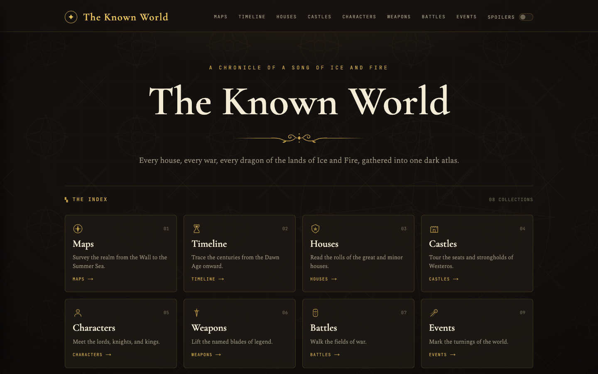                        | **Interactive world map**<br>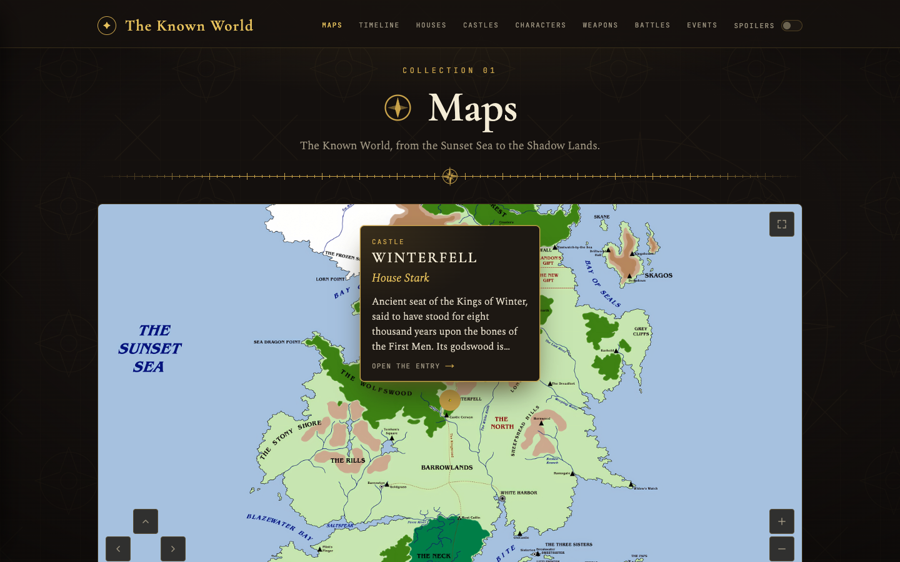    |
| **Timeline**<br>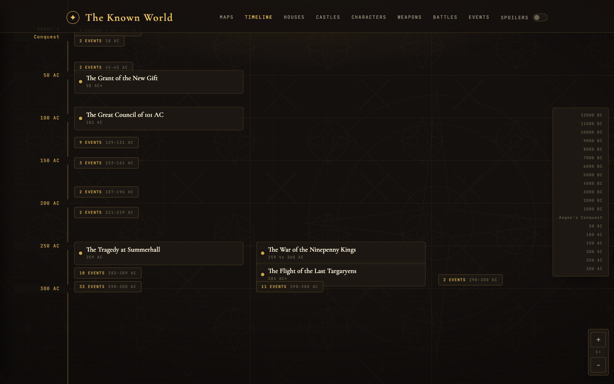            | **Events**<br>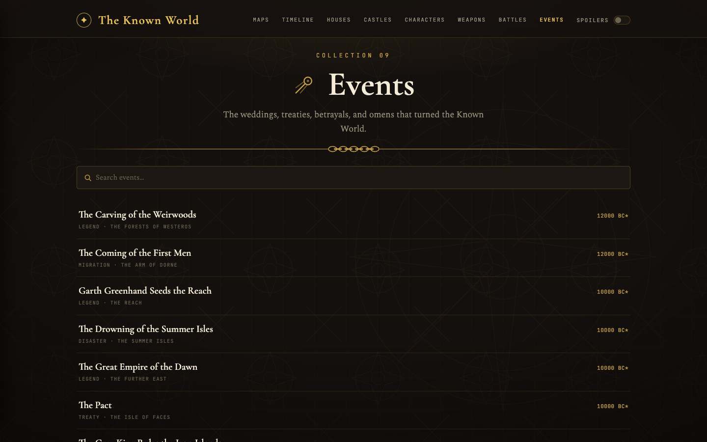          |
| **House index**<br>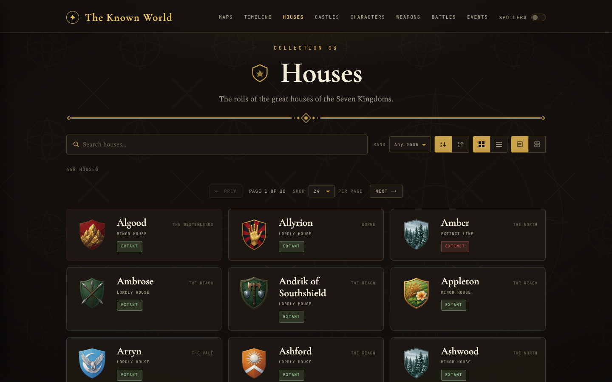             | **House Stark**<br>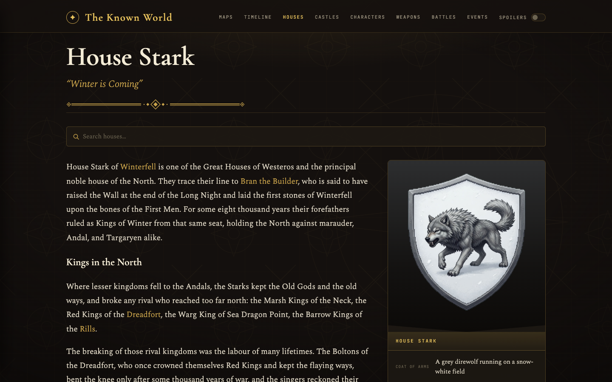            |
| **Character index**<br>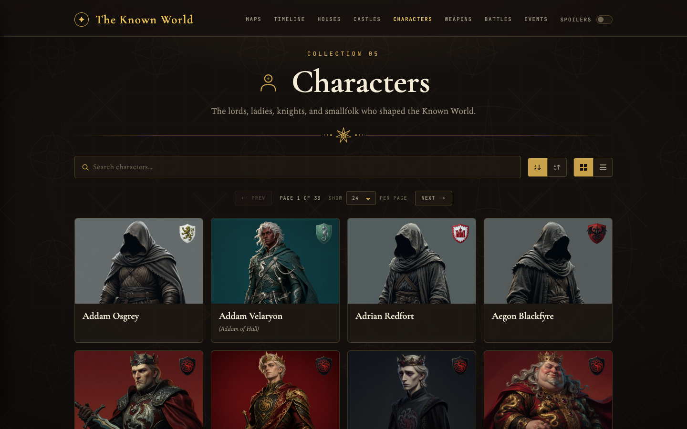 | **Jon Snow**<br>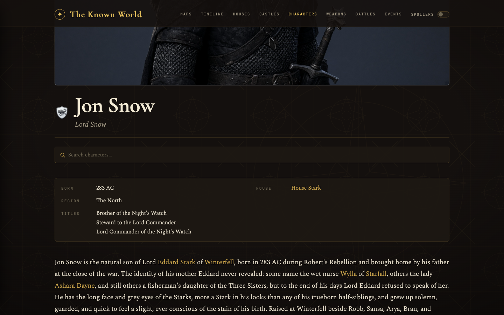 |
| **Castle index**<br>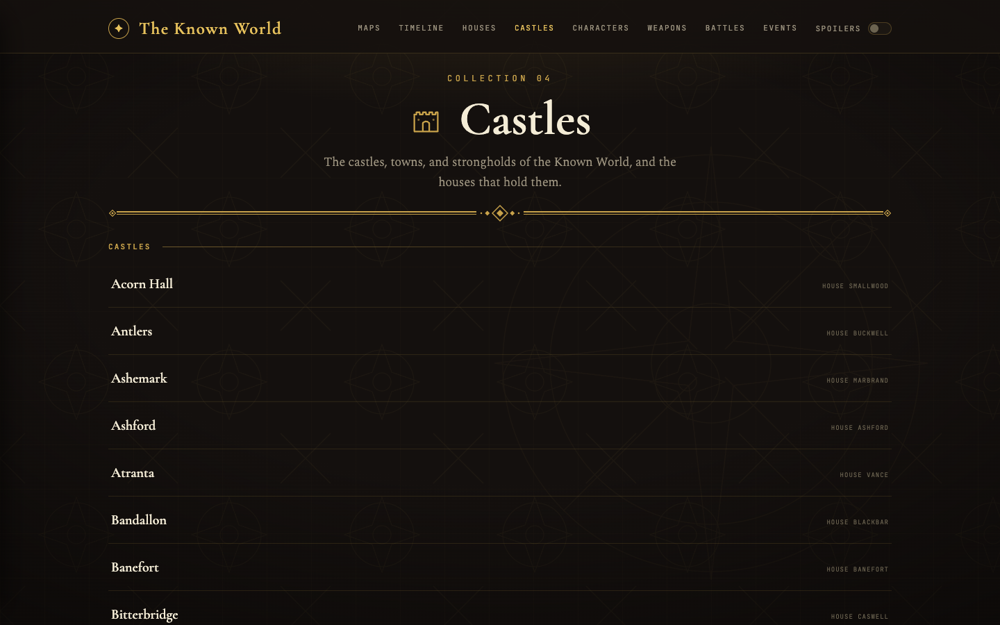                     | **Winterfell**<br>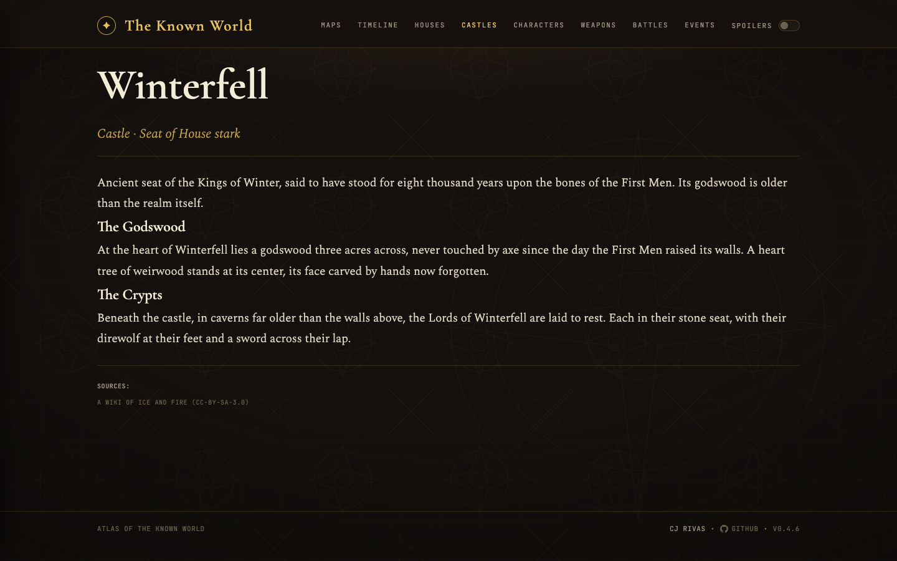 |
| **House Targaryen**<br>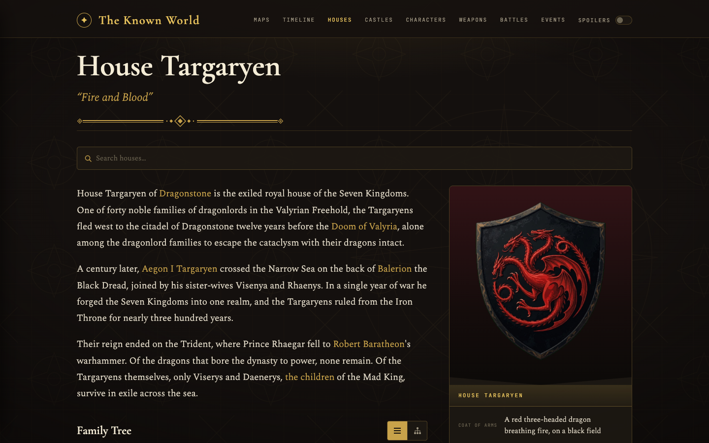        | **Dragons**<br>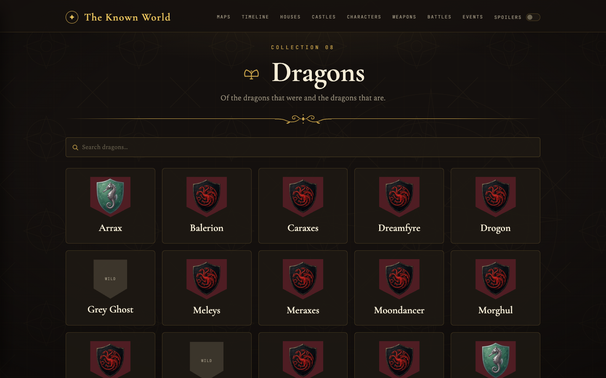                  |
| **Battles**<br>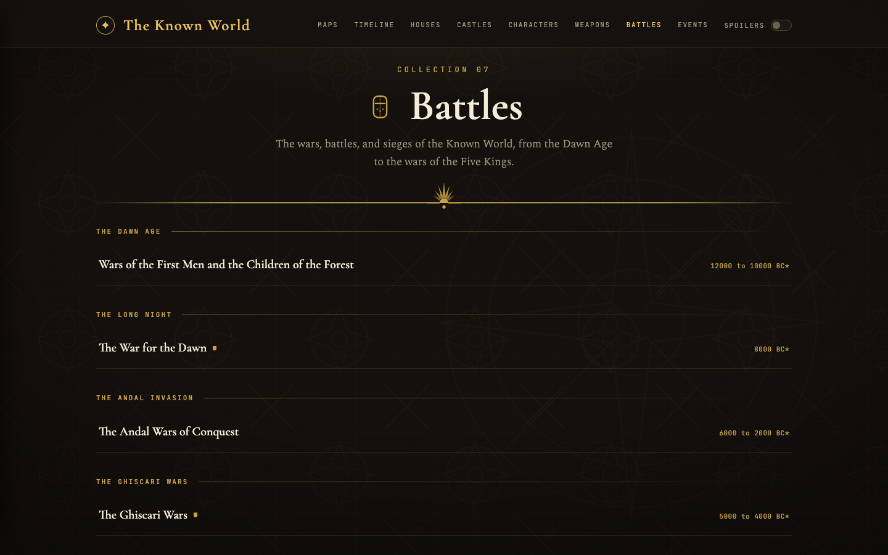           | **Weapons**<br>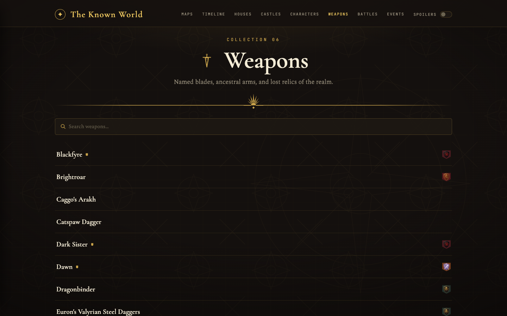       |

## Features

- Pan-and-zoom world map with hotspots on the great seats, a hover popover for
  each, and toggleable castle, battle, and event layers
- Timeline of battles and events laid out by region, with a minimap and zoom
- Searchable indexes, with sorting and pagination for houses and characters,
  whose state lives in the URL
- House family trees in list and chart views
- Character portraits with hover videos and later-life variants
- A global Spoilers switch, remembered per browser, that hides later-life
  portraits until it is turned on
- Prose that links mentioned characters, houses, castles, battles, events,
  dragons, and weapons to their entries

## Stack

- Next.js 16 App Router with static export
- React 19 and TypeScript
- SCSS modules
- Markdown content with YAML frontmatter, validated by Zod
- `nuqs` for URL search state, `react-svg-pan-zoom` for the map
- Bun's test runner with Testing Library and happy-dom
- Oxlint, Oxfmt, Gale, `typos`, and `tsgo` for the quality gates
- Bun for dependency management and scripts
- Netlify for deployment and image transformation

## Requirements

- Node.js 24.16 or newer
- Bun 1.4.2 or newer

## Getting started

Install dependencies and start the development server:

```sh
bun install
bun dev
```

The site is available at <http://localhost:46642>.

## Commands

```sh
bun run dev             # start the development server
bun run build           # create the static export in out/
bun run clean           # remove the .next build cache
bun run test            # run the test suite once
bun run test:watch      # run tests in watch mode
bun run coverage        # run tests with coverage thresholds
bun run typecheck       # check TypeScript with tsgo
bun run lint            # run lint:ts, lint:scss, and lint:actions
bun run lint:ts         # run Oxlint on TypeScript
bun run lint:scss       # run Gale on SCSS
bun run lint:actions    # run actionlint on GitHub workflows
bun run format          # format with Oxfmt
bun run format:check    # check formatting with Oxfmt
bun run spellcheck      # check spelling with typos
bun run system-check    # clean, typecheck, lint, spellcheck, test, and build
```

`lint:ts:fix` and `lint:scss:fix` apply the linters' automatic fixes.

Repository scripts must be run through Bun. Dependencies are pinned to exact
versions in `package.json`.

## Routes

| Route                 | Description                         |
| --------------------- | ----------------------------------- |
| `/`                   | Main atlas menu                     |
| `/maps/`              | Interactive world map               |
| `/timeline/`          | Chronological battles and events    |
| `/houses/`            | Searchable and grouped house index  |
| `/houses/[slug]/`     | House details and family tree       |
| `/castles/`           | Castle index                        |
| `/castles/[slug]/`    | Castle details                      |
| `/characters/`        | Searchable character index          |
| `/characters/[slug]/` | Character details and relationships |
| `/weapons/`           | Weapon index                        |
| `/weapons/[slug]/`    | Weapon details                      |
| `/battles/`           | Battle index grouped by era         |
| `/battles/[slug]/`    | Battle details                      |
| `/events/`            | Searchable event index              |
| `/events/[slug]/`     | Timeline event details              |
| `/dragons/`           | Dragon index (hidden from the nav)  |
| `/dragons/[slug]/`    | Dragon details                      |
| `/design/`            | Design system reference             |

## Repository layout

```text
.claude/     Repository skills and agents
.github/     Pull request, merge, and review workflows
app/         Next.js routes and route-level styles
components/  Reusable UI components and co-located tests
content/     Markdown collections for atlas entities
docs/        Feature specifications, plans, and screenshots
lib/         Content loading, validation, relationships, and utilities
netlify/     Local Netlify build plugins
public/      Images, sigils, maps, and other static assets
styles/      Global design tokens, breakpoints, and typographic primitives
test/        Test preload (happy-dom, CSS module and next/image shims) and stubs
types/       Ambient type declarations
```

## Content model

Each entity is stored as `content/<collection>/<slug>.md`, across seven
collections: `battles`, `castles`, `characters`, `dragons`, `events`, `houses`,
and `weapons`. Its filename must match the `slug` in its YAML frontmatter.
Frontmatter is parsed and validated against the corresponding schema in
`lib/schemas.ts`.

Cross-references use slugs. The content-integrity test validates unique slugs,
filename/frontmatter agreement, and references between modeled entities. Run it
directly with:

```sh
bun run test lib/content-integrity.test.ts
```

Named people that are needed for a relationship but do not yet have a complete
article can use the character schema's `placeholder` fields. Draft entries are
excluded from generated route parameters.

## Development workflow

Read `CLAUDE.md` for repository conventions before making changes. In
particular:

1. Create a branch for each feature or bug fix, with a flat kebab-case name.
2. Keep tests co-located with their implementation.
3. Run `bun run system-check` before handing off a change.
4. Prefix commit subjects and pull request titles with `TKW:`.

The pre-commit hook runs `lint-staged` (Oxlint, Gale, and Oxfmt on staged
files), then the spellcheck, type check, and test suite. The pre-push hook
fetches, prunes, and prints recent history. Pull requests run every gate plus
the production build in GitHub Actions, skipping the build when its inputs are
unchanged.

## Deployment

`next.config.ts` configures `output: "export"`, so `bun run build` writes the
deployable site to `out/`. Netlify runs the same build, publishes `out/`, and
uses the custom image loader in `lib/netlify-image-loader.ts` for production
image transformations.

Content source attribution is rendered from each entry's `sources` frontmatter.
